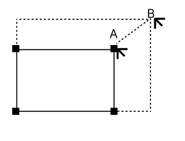

# Assessment 4 (ReactJS)

[Please see course website for full spec](https://cgi.cse.unsw.edu.au/~cs6080/NOW/assessments/assignments/ass4)

## Changelog

- 31/01/2026 - Initial spec ready for 26T1

## Due date

This assignment is due *Monday 20th April, 8pm*.

## Compulsory setup

Please run `./util/setup.sh` in your terminal before you begin. This will set up some checks in relation to the "Git Commit Requirements". If you ran this script before the MR rolled out specified in changelog, please run it again.

It's important to note that you should **NOT** use any pre-built web app templates or any AI web app creators for this assignment.

## 2. Your Task - Presto

In March of 2026 you and your friends pitched a startup idea to produce _An alternative to [slides.com](https://slides.com) that is a lean, lightweight app that is a lot more enjoyable and interesting to use_ and that will _revolutionise the presentations industry for decades to come_. You pitched this solution in the form of a web-based application, and called this quiz application 🪄🪄🪄**Presto**🪄🪄🪄.

A week later you received a tentative $50,000 investment from an [Angel Investor](https://en.wikipedia.org/wiki/Angel_investor) pending you producing a working minimum viable product of the application.

Shortly after you discussed the functionality and feature set with your friends, and wrote out a RESTful specification / interface together so that you can split up the frontend and backend work between the group. You build the frontend, they build the backend. To get things moving, the backend was built EXTREMELY light in order to reduce the amount of interfacing needed.

Whilst you (and optionally another one of your friends) decided to work on building the frontend. You wrote a list of requirements and functionalities your frontend should adhere to (described in \`section 2\`). You also decided to complete this application in \`React.js\`, a declarative framework for building single page applications. This front-end will interact with a Restful API that your team members are producing, based on the pre-defined interface.

Because your MVP is only going to be demonstrated once, your team considers it imperative that your frontend is thoroughly tested.

To satisfy modern tastes and expectations you have also decided to ensure that the UI/UX and Accessibility standards are very high.

To make it easier for your friends from non-coding backgrounds to demo this application, you have decided to deploy this application on [Vercel](https://vercel.com/).

This assignment is closely modelled off the popular website [slides](https://slides.com/). If you're not familiar with the site, we would recommend spending the time to try it out so that you can get a feel for how this application may function as a reference point.

Anything marked 🙉🙉🙉 only needs to completed by pair-attempts and not individual-attempts.

All success/error/warning messages shown to users should use appropriate UI components, you are **not** allowed to use `alert` throughout this assignment.

### 2.1. Feature Set 1. Login & presentation Creation (10%)

This feature set focuses solely on the ability to register, login, and logout. It does not concern itself with any functionality or screens that come after logged in - if the dashboard when logged in is just a blank screen with a logout button, then that is satisfactory for this feature set.

#### 2.1.1 Landing Page

- A unique route must exist for this screen E.G. `/`

- The landing page must be a simple welcome page with login/register entries

#### 2.1.2. Login Screen
  
- A unique route must exist for this screen E.G. `/login`

- User must be able to enter their `email` and `password` in a form

- A button must exist to allow submission of the form

- If the form submission fails when user tried to login, a reasonable error message should be shown

- The login form must be able to be submitted on `enter` key, pressing enter key to login should be an alternative option along with clicking a button

- Successfully login will take user to the dashboard screen

#### 2.1.3. Register Screen

- A unique route must exist for this screen

- User must be able to enter their `email` and `password` and `name` in a form

- A confirm `password` field should exist where user re-enters their password

- If the two passwords don't match, the user should receive an error message before submission.

- If the form submission fails when user tried to register, a reasonable error message should be shown

- A button must exist to allow submission of form

- The register form must be able to be submitted on enter key, pressing enter key to register should be an alternative option along with clicking a button

- Successfully register will take user to the dashboard screen

#### 2.1.4. Logout Button

- On all screens that require an authorised user, a logout button exists.

- This logout button, when clicked, returns you to the landing page.

#### 2.1.5. Error Popup

-   Whenever the frontend or backend produces an error, including but not limited to the login and registration processes, an error popup shall be displayed on the screen with an appropriate message (either derived from the backend error response or meaningfully created on the frontend).
-   This popup can be closed/removed/deleted by pressing an "x" or "close" button.
  
### 2.2. Feature Set 2. Setting up slides (13%)

#### 2.2.1. Dashboard Page

- A unique route must exist for this screen E.G. `/dashboard`

#### 2.2.2. New presentation on Dashboard

- When logged in, users should be presented with a dashboard that contains a button, only visible on the dashboard, for creating new presentation. E.G "New presentation".

- When this button is pressed, a popup([modal](https://www.w3schools.com/w3css/w3css_modal.asp)/[dialog](https://m2.material.io/components/dialogs)) appears, where a user can enter the `name`, `description` and add thumbnail of a new presentation

- This popup should contain a "Create" button for user to click and create presentation. The popup should disappear after user clicked "Create" button, a new presentation is created and appears on the dashboard. It is a default presentation containing a single empty slide (info on this later).

#### 2.2.3. List of presentations on Dashboard

- On the dashboard page, the [card](https://m2.material.io/components/cards) for each presentation should appear as rectangles with a **2:1 width:height** ratio.

- Each rectangle should include `name`, `thumbnail` (grey square if empty), `description` (no text if empty) and the Number of slides it contains

- Rectangles should be evenly spaced in several rows and columns if needed, where each rectangle has a minimum of `100px` width, the actual width of rectangles in different viewports should look reasonable.

#### 2.2.4. Basics of a presentation controls

- When a particular presentation rectangle on the dashboard is clicked, the user should be taken to a new unique route that is parameterised by the presentation's ID, which always loads the first slide in the slideshow deck. This route is for editing a specific presentation, users can add/delete/edit(Info on this later) slides in this presentation within this page.

- When on this edit presentation page, Two key controls should always be visible and functional, regardless of which slide users are on:

  - "Back" that takes users back to the dashboard.

  - "Delete Presentation" which triggers a popup containing text "Are you sure?", where if "Yes" is clicked, the presentation is deleted and users are taken to the dashboard page. If "No" is clicked, then the popup disappears and the page remains still.

#### 2.2.5. Title & Thumbnail editing

- When viewing a particular presentation, the title of the presentation should be visible at all times somewhere on or above the slideshow deck regardless of which slide users are on.

- Somewhere near the title should have some text/icon/graphic/button that user can click to bring up a modal to edit the title of the presentation.

- There should be a way on presentation screen which allows user to update the thumbnail of the presentation.

#### 2.2.6. Creating slides & moving between

- When visiting a particular slide, a button should be visible that allows users to create a new slide.

- Creating a new slide will add another slide at the end of the slideshow deck. The slide number must be indicated at the `bottom-left` of the slide, starting from "1".

- Once the slideshow deck has at least two slides, controls should appear at a reasonable position in the slideshow deck:

  - These controls should be two arrows, left and right.

  - When users click on these arrows, it takes them to the next or previous slide

  - When users click the associated keyboard keys(**left key** and **right key** in this case), the same corresponding action should happen

  - If users are viewing the first slide, previous arrow should be disabled and visually different

  - If users are viewing the last slide, next arrow should be disabled and visually different

#### 2.2.7. Deleting slides

- When visiting a particular slide, a button should be visible that allows users to delete that slide.

- If a user tried to delete the only slide in the slideshow deck, an error message should popup instead asking to delete the presentation.

Note: The behaviour after current slide is deleted could be implemented entirely up to your design. E.G. _redirect user to the previous slide_

### 2.3. Feature Set 3. Putting Elements on a slide (14%)

- Any time when users are prompted for the "size" of an element below, size is always represented as a **percentage (%)** between 0 and 100 where:

- For width, 100 represents the full width of the deck, 50 represents half the width, etc

- For height, 100 represents the full height of the deck, 50 represents half the height, etc etc

- When any element is first added to the slide, it is always positioned at the top left corner of the slide.

- Double clicking (within 0.5 seconds) on any element in a slide will allow you to edit the initial properties (discussed in later scope) that are set when this element was created, as well as an extra property called _position_ that describes where the top left of the element will appear on the slide. This property is expressed as an `x` and `y` co-ordinate between `0` and `100` (similar to what is described above).

- You can order the "layer" property of each element by having the most recent created element be higher than the previous one. This will help in situations where they are layered on top of one another.

- Each element in a slide can be deleted by right clicking anywhere within its block.

#### 2.3.1. Putting TEXT on the slide

- Somewhere on the slideshow edit screen, for each slide, there should be an action that is clearly described as adding a text box to the current slide. This action can be immediately visible in a list of tools, or can be hidden away by some kind of collapsable panel.

- When this action is clicked, a modal should appear and accept inputs from users for

1. The size of the text area

2. The text in the textarea

3. The font size of the text in `em` as a decimal

4. The colour the text as a [HEX color code](https://www.w3schools.com/css/css_colors_hex.asp).

- The text is always top-down and left-aligned.

- If any text overflows, the block should support scrolling (auto-wrapping text is not required).

- Each block should have a soft grey border around the outside of it.

- Double clicking the text block will allow user to edit properties discussed above

#### 2.3.2. Putting an IMAGE on the slide

- Somewhere on the slideshow edit screen, for each slide, there should be an action that is clearly described as adding an image to the current slide. This action can be immediately visible in a list of tools, or can be hidden away by some kind of collapsable panel.

  - When this action is clicked, a modal should appear and accept inputs from users for

    1. The size of the image area

    2. Either the URL or a file from local system being parsed to base64 string encoding of the whole image itself

    3. A description of the image for an `alt` tag

- Double clicking the image block will allow user to edit properties discussed above

- Images should be `center-aligned` with the block, and scaled to the size of the block rather than cut off if its dimensions exceed that of the block
  

#### 2.3.3. Putting a VIDEO on the slide

- Somewhere on the slideshow edit screen, for each slide, there should be an action that is clearly described as adding a video to the current slide. This action can be immediately visible in a list of tools, or can be hidden away by some kind of collapsable panel.

  - When this action is clicked, a modal should appear and accept inputs from users for

    1. The size of the video area

    2. The URL of the youtube video to display - Embedded video Url: E.G. https://www.youtube.com/embed/dQw4w9WgXcQ?si=ZVLBiX_k2dqcfdBt

    3. Whether or not the video should auto-play

- Double clicking the video block will allow user to edit properties discussed above

Note: You can wrap a container/border outside of the `<video />` element to enable a user to edit the properties (_E.G. With a clickable border_), the exact UI of the container is up to you.

#### 2.3.4. Putting CODE on the slide

- Somewhere on the slideshow edit screen, for each slide, there should be an action that is clearly described as adding a code block to the current slide. Code block can be presented similar to a `textarea`. This action can be immediately visible in a list of tools, or can be hidden away by some kind of collapsable panel. Each code block only contains one programming language.

  - When this action is clicked, a modal should appear and accept inputs from users for

    1. The size of the code block

    2. The code in the code block

    3. The font size of the text in `em` as a decimal

- The code entered should have whitespace preserved when displayed on screen

- The code should not have its `font-family` changed if you completed `2.4.1`

- The code should also be syntax highlighted appropriately to the language being chosen:

  - Valid languages are C, Python, Javascript. You need to support all of them to gain the mark for this feature.

  - This element should be able to distinguish between different programming languages based on the input **automatically**

- Double clicking the code block will allow user to edit properties discussed above

#### 2.3.5. 🙉🙉🙉 Making elements movable

- For all of `2.3.1`, `2.3.2`, `2.3.3`, `2.3.4`, change it so that:

  - When you double click on a block, position is no longer an option to edit the location of the it

  - When you click on a block once, each of the 4 corners should now have a small `5px` x `5px` solid box on it, whereby:

    - If the user clicks and drags the box, they can change the position of the box (maintaining aspect ratio).

    - The block cannot have any of its corners extend beyond the edges of the slide.

#### 2.3.6. 🙉🙉🙉 Making elements resizable

- For all of `2.3.1`, `2.3.2`, `2.3.3`, `2.3.4`, and `2.3.5`, change it so that:

  - When you double click on a block, size is no longer an option to edit the size of the block

  - When you click on a block once, each of the 4 corners should now have a small `5px` x `5px` solid box on it, whereby:

    - If the user clicks and drags the corners, they can increase or decrease the size of the box.

    - The block cannot be resized smaller than `1%` of width or height of the slide dimensions.

    - The block cannot have any of its corners extend beyond the edges of the slide.

    - An example of this behaviour can be described as:

      

### 2.4. Feature Set 4. Further Features (13%)

#### 2.4.1. Font adjustment

- For all text boxes on the slide, on the slideshow edit screen, the user should be able to change the `font-family` of them, the user should be able to choose from at least 3 different font-famlies.

You are free to implement it as:

- A. Each text box has its own font-family property

- B. Font-family as a per presentation level setting for the one user is editing

- C. Font-family as a per slide level setting for the one user is on

  

#### 2.4.2. Theme and background picker

- There should be a button, visible on all slides, when users click on it and it brings up a modal.

- In this modal, you can specify:

  - The current slide's background style. Choices are:

    - Solid colour

    - Gradient

    - Image _(spread to cover the whole slide)_

  - The default background colour/gradient/image based on user's choice in background option.

    - This is the default slide background instead of white.
    - Changing this will apply it globally to all future slides that are created and any slide with the default background style
    - It will not apply to any slides where the individual (current) slide's background style has been modified

  - If the user has modified the current slide's background style, it will override the default background style

Note: You are free to choose from different gradient directions (e.g. top to down/left to right). It's fully up to you to design a UI that allow users to choose different background options and colours/images

#### 2.4.3. Slide control panel

- A button should be accessible on every slideshow deck that brings up the slide control panel.

- The slide control panel should display every slide as a rectangle with the slide number ie. "Slide 1", "Slide 2" and so forth. This feature is extended in (2.4.7)

- The rectangles should be sized such that they can all fit on the viewport. If your slides exceed the viewport, it should be scrollable.

- Users can click on a slide to navigate to it

- There is a close button to exit this screen.

#### 2.4.4. Preview viewing

- Each slideshow deck should have a button somewhere (immediately visible or behind a panel) that users can click to preview the presentation

- Previewing the presentation simply opens another tab in your browser where:

  - The slideshow deck is visible to the full size of the screen in your browser

  - The arrow controls and slide numbers are still visible and functional, clicking on the arrows should display the previous/next slide accordingly.

  - Each block should have no border around it.

#### 2.4.5. URL Updating

- For both editing a slideshow deck and previewing presentation, when on a particular slide, the slide number should be reflected in the URL such that if the page is refreshed, the current user will be navigated to the same page.

#### 2.4.6. 🙉🙉🙉 Slide transitioning

- Add at least one form of animation when transitioning between slides in the slideshow deck. Examples of this may be:

  - Swipe left/right

  - Fade in and out or cross-fade

- These slide transitions must show in the preview, and optionally in the slide deck while you are editing your slides
 

#### 2.4.7. 🙉🙉🙉 Slide Re-arranging & Preview

- On the slide control panel (2.4.3), users can click and drag a particular slide and drop it between another two slides to re-arrange it.

- Instead of just the slide number as text as per (2.4.3), each rectangle in the control panel should show a mini-preview of all the content on the slide (incl. slide background)
  

#### 2.4.8. 🙉🙉🙉 Revision History

- A button should be accessible on every slideshow deck (either immediately, or behind a control panel) that brings up the version history page.

- This should show a list of ALL moments in history such that users can "restore", which restores all slides in the deck to a previous state.

- These previous state moments should be captured by you on every modification of the slideshow deck that occurs with a minimum of 1 minute between saves.

  

### 2.5. Linting and TSC compliance (5%)

- Linting must be run from inside the `frontend` folder by running `npm run lint`. You have to make sure linting doesn't produce **any** error and warning to gain marks for linting section.
- Additionally, your code must be typescript compliant when running  `npm run tsc`. You must past both of these checks to gain the marks for this section.
  

### 2.6. Testing

As part of this assignment you are required to write some tests for your application as a whole (ui testing).

For **ui testing**, you must:

- Write a test for the "happy path" of an admin that is described as:

  1. Registers successfully

  2. Creates a new presentation successfully

  3. Updates the thumbnail and name of the presentation successfully

  4. Add some slides in a slideshow deck successfully

  5. Switch between slides successfully

  6. Delete a presentation successfully

  7. Logs out of the application successfully

  8. Logs back into the application successfully

- You are also required to write a test for another path through the program, describing the steps and the rationale behind this choice in `TESTING.md`, this path **must** contain different features than the ones described in the previous path.

#### Advice for UI Testing

- For cypress, consider adding `cy.wait(1000)` if necessary to add slight pauses in your tests if you find that the page is rendering slower than cypress is trying to test.

- If you're having issues using Cypress on WSL2, try following [this guide](https://shouv.medium.com/how-to-run-cypress-on-wsl2-989b83795fb6).

  

#### Other advice / help

- The tutor will run an empty (reset) backend when running `npm run test` whilst marking.

#### Running tests

Tests must be run from inside the `frontend` folder by running `npm run test`. Then you might need to press `a` to run all tests.

You are welcomed to modify the `npm run test` command by updating the `test` script inside `frontend/package.json`. For example, if you would like to run your cypress UI tests you can use `npm run cypress open` .

  ### 2.7. Deployment (5%)

- Instructions for deployment are present in `deployment.md`. You are only required to deploy the frontend on vercel to achieve full marks for this criteria.
- Deploying the backend is eligible for bonus marks

### 2.8. Other notes

- The port you can use to `fetch` data from the backend is defined in `frontend/backend.config.json`

-  [This article may be useful to some students](https://stackoverflow.com/questions/66284286/react-jest-mock-usenavigate)

